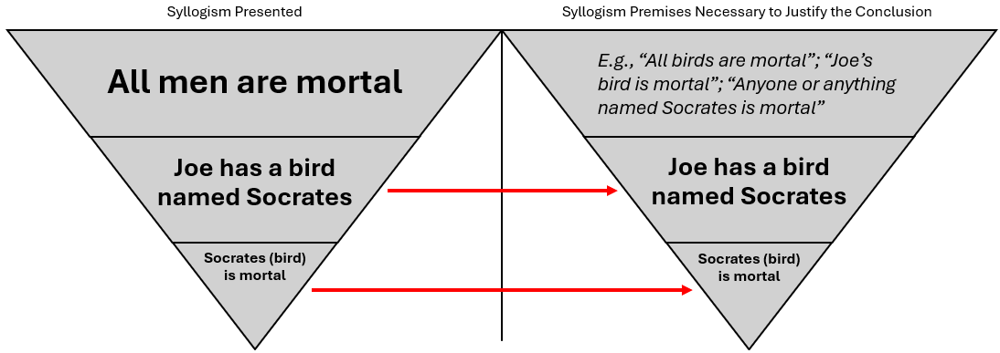

# 1.2.1 Introduction to Deductive (Rule-Based) Reasoning

The best place to start is to appreciate that legal reasoning is fundamentally comprised of logic. Whether thinking about civil liability or other areas of law, the courts and professionals apply specific methodologies when making decisions.

There are different legal reasoning/analysis methods, but professionals most commonly engage in both (1) [**deductive reasoning**](1.2.1-introduction-to-deductive-rule-based-reasoning.md#introduction) (i.e., syllogistic reasoning) and (2) **inductive reasoning** (in our context, this is reasoning by analogy).&#x20;

## Introduction

Most of the analysis you will perform in this class will involve deductive reasoning, which is also called [syllogistic ](#user-content-fn-1)[^1]reasoning. What we will see is that deductive reasoning produces conclusions from a set of established premises (assertions): [If A is true and B is true, then C must be true](#user-content-fn-2)[^2].

The syllogism represents a fundamental depiction of the deductive reasoning process in law, which starts with a **general assertion or proposition and ends with a specific assertion (i.e., the conclusion)**. Imagine this approach as a funnel or an [inverted pyramid](#user-content-fn-3)[^3].&#x20;

<figure><figcaption>
Inverted Pyramid
</figcaption></figure>

The following sections discuss the working principles of deductive reasoning based on the syllogistic process and its relationship to legal reasoning and analysis.

## Syllogisms

### Simple Syllogisms

#### A Classic Simple Syllogism

A classic example of deductive reasoning is the "[Socrates syllogism](https://ancientspast.com/the-history-of-the-most-famous-syllogism/)":

> **Major Premise:** All [men ](#user-content-fn-4)[^4]are mortal.
>
> **Minor Premise:** Socrates is a man[^5].
>
> **Conclusion:** Socrates is mortal.

In other words, if all men are mortal, and if Socrates is a man, then Socrates is mortal. The reasoning starts with a broad premise, and the analysis applies the broad premise to the minor premise to yield the conclusion. Another way to envision this is by creating a Venn diagram:

<figure><figcaption>
Venn diagram illustrating the "Socrates syllogism"
</figcaption></figure>

In the Venn diagram, we see the two subjects contained in the **major premise**: Men are in the category of all things that are mortal. The **minor premise** places Socrates within the category of men. Therefore, because the relationships between the Venn diagram categories require the **conclusion** that Socrates is mortal.

#### Validity and Truth in Reasoning

It must be noted at the outset that in an argument's reasoning, there is an important distinction between a logically **valid** argument and a sound argument. **Sound** arguments must include [**both** **valid** reasoning and **true** premises](#user-content-fn-6)[^6]. If any premise is false, then the argument is unsound and functionally illegitimate. if all the premises are true, the reasoning can still be invalid and render the reasoning flawed.

For reasoning to be valid, conclusions must be compatible with and relevant to the given premises. Significantly, however, whether the reasoning is valid is [_unrelated_ ](#user-content-fn-7)[^7]to whether the premises are true and accurate. To illustrate, let's revise the previous syllogism as follows:

> **Major Premise:** All men are mortal.
>
> **Minor Premise:** Joe has a bird named Socrates.
>
> **Conclusion:** Socrates, Joes bird, is mortal.

Although the premises and the conclusion may all be true, the syllogism's reasoning is invalid. The premise that Socrates is a bird is incompatible with all men being mortal. Specifically, the argument's reasoning is invalid because the minor premise that "all men are mortal" does not fit within the overarching category of Socrates being a bird. Here is how this syllogism's reasoning looks visually:

<figure><figcaption></figcaption></figure>

In this syllogism, we see how the **minor premise** about a bird and the subsequent **conclusion** about the mortality of the bird cannot follow from the **major premise** that all men are mortal. As the diagram's arrows indicate, they must be part of a different funnel. Thus, we can see the invalidity of the syllogism presented. Now, if we look at the funnel to the right, the **conclusion** that Socrates—the bird—is mortal is also invalid, regardless of whether it is true. For this **conclusion** to be valid, a **major premise** is required that encompasses birds and mortality, such as "All birds are mortal"; "Joe's bird is mortal"; "Anyone or anything named Socrates is mortal"; etc.&#x20;

Another illustration of this point is a Venn diagram:

<figure><figcaption>
Venn diagram illustrating the invalidity of the "Joe's bird" syllogism
</figcaption></figure>

In this Venn diagram, we see the two subjects contained in the **major premise**: Men are in the category of all things that are mortal. The **minor premise** places Socrates in the category of birds. But the syllogism's premises prevent the **conclusion** that Socrates—the bird—is mortal. Again, for that conclusion to result from valid reasoning, the syllogism should include a premise that includes the mortality of birds. (On a different note, this diagram happens to demonstrate the unstated premise that birds are mortal. The unstated premise is called an [enthymeme](1.2.1-introduction-to-deductive-rule-based-reasoning.md#enthymemes). Reasoning that uses enthymemes is discussed in detail [below](1.2.1-introduction-to-deductive-rule-based-reasoning.md#enthymemes).)

#### Beware of Other Logical Errors in Deductive Reasoning

Another problem impacting validity may be less conspicuous than the preceding syllogisms. For example:

> **Major Premise:** Some writers make syllogistic arguments.
>
> **Minor Premise:** Matt is a writer.
>
> **Conclusion:** Therefore, Matt made a syllogistic argument.

The conclusion is based on a logical error because the syllogism lacks facts to determine whether Matt falls within the class of "some" writers who make syllogistic arguments. All of the evidence we have about Matt is that he is a writer, but this means only that Matt might be a writer who either (1) made a syllogistic argument or (2) did not make a syllogistic argument. There is no evidence from the premises to conclude on way or another. In a Venn diagram, for example, there would be two groups related to writers: Writers who do make syllogistic arguments and those who do not. But even though Matt is a writer, there is there no way to tell which is Matt's group. Thus, the conclusion is invalid.

Some logical flaws can be more subtle. Take the following syllogism, [for example](#user-content-fn-8)[^8]:

> **Major Premise:** All superheroes have at least one ability that is superhuman (i.e., more exceptional or extraordinary than homo sapiens are considered capable of).\*[^9]
>
> **Minor Premise:** Superman can travel faster than the speed of light.
>
> **Conclusion:** Superman is a superhero.

Unlike the "some writers" example above, this major premise applies to an entire class. However, like the "some writers" example, even if each part of the syllogism is true does not mean that the the logic is valid; _this "superhero" syllogism is flawed_. Stating that all superheroes have a superhuman ability _does not_ mean that superheroes are the only beings with superhuman abilities. So, the premises in this argument lack the facts necessary to logically conclude that Superman is a superhero.

### Polysyllogisms

Because real-life circumstances can be complex, deductive reasoning _frequently_ requires applying more premises than exist with simple syllogisms. These circumstances require a **polysyllogism**—a syllogism with [more than two premises—to include a more complex analysis to support a conclusion](#user-content-fn-10)[^10].&#x20;

#### A "Socrates" Polysyllogism

Here is an [example ](#user-content-fn-11)[^11]of a polysyllogism based on the Socrates syllogism, and the issue is whether Socrates is a god:

> **Major Premise 1:** Anyone or anything that is mortal is subject to death. &#x20;
>
> **Major Premise 2:** All humans are mortal.
>
> **Major Premise 3:** Those who are mortals are not gods.
>
> **Minor Premise:** Socrates is a human.
>
> **Analysis Leading to the Conclusion:**&#x20;
>
> * Because mortals can die, and all humans are mortal, humans can die.
> * Because those who can die are not gods, humans are not gods.
> * Because Socrates is a human, Socrates can die.&#x20;
> * Because Socrates can die, Socrates is not a god.

In this example, we see how the analysis supporting the argument that Socrates is a god requires the application of multiple premises to one another. Each step of the analysis was explicit and did not include any implicit presumptions (i.e., propositions presumed to be true and not explicitly stated by the arguer). However, people frequently make arguments using enthymemes. Enthymemes _can_ be legitimate, but depending on the reasoning, they can also allow for fallacious and otherwise flawed arguments.&#x20;

## Enthymemes

In their arguments, many people use [**enthymemes**](#user-content-fn-12)[^12]**,** which are implicit premises. Generally, arguers will use enthymemes for efficiency when they presume that the omitted premise is obvious[^13].&#x20;

In daily conversations, political arguments, legal reasoning (including judicial[ opinions](#user-content-fn-14)[^14]), etc., enthymemes are common. For example[^15]:

> * Drunk driving hurts innocent people.
> * Therefore, drunk driving is wrong.

This argument contains an implicit premise: Hurting innocent people is wron&#x67;_._ In other words, the argument presumes that hurting innocent people is wrong. &#x20;

But enthymemes must be treated [with caution](#user-content-fn-16)[^16] because some people may use them unintentionally or intentionally as [hasty generalizations](#user-content-fn-17)[^17], or sometimes, to mislead someone that a false premise is actually true. Hasty generalizations and false premises can lead to fundamentally flawed conclusions. For example[^18]:&#x20;

> * Governor Johnson wants to reduce government regulation and oversight.
> * Therefore, Governor Johnson is an anarchist.

Here, the presumption is that a person who wants to reduce government regulation and oversight is an anarchist. Certainly, this presumption cannot be universally true. Thus, the result—Governor Johnson is an anarchist _because_ he wants to reduce regulation and oversight—is fundamentally flawed because of a hasty generalization (one of many [**fallacies** ](#user-content-fn-19)[^19]that people make in arguments).

Since this is a class about the law, we next explore how deductive reasoning applies in the legal context.

***

Licensing

Except where otherwise noted, [Introduction to Deductive (Rule-Based) Reasoning](1.2.1-introduction-to-deductive-rule-based-reasoning.md) by Matthew L. Mac Kelly is licensed under [CC BY-NC-SA 4.0](https://creativecommons.org/licenses/by-nc-sa/4.0/?ref=chooser-v1).&#x20;

[^1]: See [Syllogisms](1.2.1-introduction-to-deductive-rule-based-reasoning.md#syllogisms); [Kulicki (2020)](broken-reference).

[^2]: [Aldisert et al.](../endnotes-landing-page-and-introduction.md), 3.

[^3]: [Swisher](../endnotes-landing-page-and-introduction.md), 537, 539 n.18.

[^4]: i.e., humans

[^5]: i.e., human

[^6]: [Southern Alberta Institution of Technology](../endnotes-landing-page-and-introduction.md) (2021).

[^7]: [Fields ](broken-reference)[(2024)](broken-reference).

[^8]: This example is adapted from [Aldisert et al.](broken-reference), 10.

[^9]: This premise is based on comic book writer Stan Lee's definition from "More Than Normal, But Believable," in Robin S. Rosenberg and Peter Coogan (eds.), [_What is a Superhero?_](https://global.oup.com/academic/product/what-is-a-superhero-9780199795277?cc=us\&lang=en&) (Oxford University Press, 2013).&#x20;

    Also, for the purposes of _this exercise_, assume both that (a) this rule is true and (b) this definition does not include those who derive their superhuman abilities exclusively from technology (e.g., Batman and Iron Man).

    Finally, Lee's definition of a superhero also includes the requirement that the hero uses their powers for doing good. This is also reflected in a court's explanation of Superman ("a person of unprecedented physical prowess dedicated to acts of \[daring] in the public interest"). _Siegel v. Nat'l Periodical Publications, Inc._, [508 F.2d 909, 911 (2nd Cir. 1974)](https://scholar.google.com/scholar_case?case=4078874509838318097\&q=%22of+unprecedented+physical+prowess%22\&hl=en\&as_sdt=6,50#p911).

[^10]: [Aldisert et al.](broken-reference), 9.

[^11]: [Aldisert et al.](broken-reference), 9.

[^12]: [Aldisert et al.](broken-reference), 8; [Nordquist](broken-reference)[ (2018)](broken-reference).

[^13]: Ruggero J. Aldisert, Stephen Clowney, & Jeremy D. Peterson, _Logic for Law Students: How to Think Like a Lawyer_. [69 U. PITT. L. REV. 1](https://doi.org/10.5195/lawreview.2007.117), 8 (2007).

[^14]: Ruggero J. Aldisert, Stephen Clowney, & Jeremy D. Peterson, _Logic for Law Students: How to Think Like a Lawyer_. [69 U. PITT. L. REV. 1](https://doi.org/10.5195/lawreview.2007.117), 8 (2007).

[^15]: Literary Terms, [_Enthymeme_](https://literaryterms.net/enthymeme/) (last visited June 20, 2024).

[^16]: [Aldisert et al.](broken-reference), 8.

[^17]: [Ramee ](broken-reference)(2002); [Nordquist ](broken-reference)(2019).

[^18]: Literary Terms, [_Enthymeme_](https://literaryterms.net/enthymeme/) (last visited June 20, 2024).

[^19]: See, generallly, [Ramee (2002)](broken-reference).
