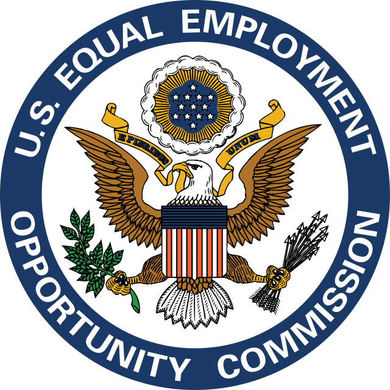

# 2.3 Important Business Laws and Regulations

Business law is a very expansive area of the law. It primarily addresses issues related to the creation of new businesses, which arise as existing companies deal with the public, government, and other companies. Business law consists of many legal disciplines, including contracts, tax law, corporate law, intellectual property, real estate, sales, immigration law, employment law, bankruptcy, and others. &#x20;

<figure><figcaption>
Employment discrimination is one of many areas of business law. (Credit: <a href="https://commons.wikimedia.org/wiki/File:Seal_of_the_United_States_Equal_Employment_Opportunity_Commission.svg">Public Domain</a>)
</figcaption></figure>

As noted, business law touches upon a number of other legal areas, practices, and concerns. Some of the most important of these, which are discussed in this section, are disputes and dispute settlement, business ethics and social responsibility, business and the United States Constitution, criminal liability, torts, contracts, labor and employment law, unfair trade practices, consumer protection, international law, and securities regulation. Though they are discussed in much more depth in later chapters, the following gives a brief overview.

## Disputes and Dispute Settlement

In addition to the federal court and individual state systems, there are also a variety of mechanisms that companies can use to resolve disputes. They are collectively called alternative dispute resolution (“ADR”), and they include mediation, settlement, and arbitration. Many states now require companies to resolve legal disputes using ADR before the initiation of any lawsuit to encourage speedy resolution, cost and time containment, and reduced judicial dockets. Traditional litigation remains an option in most cases if other efforts fail or are refused.

## Business Ethics and Social Responsibility

In the routine course of business, employees are often required to make decisions. Business ethics outline the ethical model, or framework, that companies expect employees to follow when making these decisions, as well as the behavior that the companies deem acceptable. Sound and ethical decision making can also help companies avoid legal liability and exposure. Typically, an ethics code and/or a code of conduct details a company’s requirements and guidelines, while also serving as a key corporate governance tool.

In addition to business ethics, companies must also consider their social responsibility and the laws related to it, such as consumer and investor protections, environmental ethics, marketing ethics, and ethical issues in financial management.

## Business and the United States Constitution

Since the start of the 20th century, broad interpretations of the Constitution’s Commerce and Spending Clauses have expanded the reach of federal law into many areas. Indeed, its reach in some areas is now so broad that it preempts virtually all state law. Thus, the Constitution’s Commerce Clause has been interpreted to allow federal lawmaking and enforcement that applies to many aspects of business activity. Additionally, the Constitution’s Bill of Rights extends some protections to business entities that are also constitutionally guaranteed to individuals

For example, on January 21, 2010, i&#x6E;_&#x43;itizens United v. Federal Election Commission_, 558 U.S. 310 (2010), the U.S. Supreme Court heard the issue of whether the government can ban political spending by corporations in candidate elections. The Court ruled that corporations have the same Constitutional right to free speech as individuals, and thus lifted the restrictions on contributions.

## Criminal Liability

The imposition of criminal liability is one method used to regulate companies. The extent of corporate liability found in an offensive act determines whether a company will be held liable for the acts and omissions of its employees. Criminal consequences may include penalties, such as prison, fines and/or community service. In addition to criminal liability, civil law remedies are usually available, e.g., the award of damages and injunctions, which may include penalties. Most jurisdictions apply both criminal and civil systems.

## Torts

Within the business law context, torts may involve either intentional torts or negligence. Additionally, companies involved in certain industries should consider the risk of product liability. Product liability involves a legal action against a company by a consumer for a defective product that caused loss or harm to the customer. There are several theories regarding recovery under product liability. These include contract theories that deal with the product warranty, which details the promises of the nature of the product sold to customers. The contract product warranty theories are Express Warranty, Implied Warranty of Merchantability, and Implied Warranty of Fitness. Tort theories deal with a consumer claim that the company was negligent, and therefore caused either bodily harm, emotional harm, or monetary loss to the plaintiff. The tort liability theories that can be used in this context are negligence (failure to take proper care in something), strict liability (imposition of liability without a finding of fault), and acts committed under Restatement (Third) of Torts (basic elements of the tort action for liability for accidental personal injury and property damage, as well as liability for emotional harm).

## Contracts

The main function of a contract is to document promises that are enforceable by law. The key to an agreement or contract is that there must be an offer and acceptance of the terms of that offer. Sales contracts normally involve the sale of goods and include price terms, quantity and cost, how the terms of the contract will be performed, and method of delivery.

## Employment and Labor Law

Employment and labor law is a very broad discipline that covers a broad array of laws and regulations involving employer/employee rights and responsibilities in the workplace. This law includes worker protection and safety laws, such as OSHA, and worker immigration laws, such as the Immigration Reform and Control Act, which imposes sanctions on employers for knowingly hiring illegal immigrants. Other notable areas of employment and labor law include, but are not limited to, the National Labor Relations Act, which deals with union and management relations, as well as Equal Opportunity in Employment laws, which provide workers with protections against discrimination in the workplace, e.g., Title VII, the Americans with Disabilities Act, Age Discrimination in Employment Act, and others.

## Antitrust Law

Antitrust legislation includes both federal and state laws regulating companies’ conduct and organization. The purpose of such regulation is to allow consumers to benefit from the promotion of fair competition. The main statutes implicated by antitrust law are the Sherman Act of 1890, the Clayton Act of 1914, and the Federal Trade Commission Act of 1914. These Acts discourage the restraint of trade by prohibiting the creation of cartels and other collusive practices. Additionally, they encourage competition by restricting the mergers and acquisitions of certain organizations. Finally, they prohibit the creation and abuse of monopoly power.

Actions may be brought in courts to enforce antitrust laws by the Federal Trade Commission (“FTC”), the U.S. Department of Justice, state governments, and private parties.

## Unfair Trade Practices and the Federal Trade Commission

The term “unfair trade practices” is broadly used and refers to any deceptive or fraudulent business practice or act that causes injury to a consumer. Some examples include, but are not limited to, false representations of a good or service including deceptive pricing, non-compliance with manufacturing standards, and false advertising. The FTC investigates allegations of unfair trade practices raised by consumers and businesses, pre-merger notification filings, congressional inquiries, or reports in the media and may seek voluntary compliance by offending businesses through a consent order, administrative complaints, or federal litigation.

## Securities Regulation

Securities regulation involves both federal and state regulation of securities and stocks by governmental regulatory agencies. At times, it may also involve the regulations of exchanges like the New York Stock Exchange, as well as the rules of self-regulatory organizations like the Financial Industry Regulatory Authority (FINRA).

The Securities and Exchange Commission (SEC) regulates securities on the federal level. Other instruments related to securities, such as futures and some derivatives, are regulated by the Commodity Futures Trading Commission (CFTC).

***

Attributions and Licensing

Page cover image: "Cabinet of the United States" by [University of Illinois Chicago](https://researchguides.uic.edu/c.php?g=252249\&p=4522901).

Except where otherwise noted, this page's content is adapted from [1.3 Important Business Laws and Regulations](https://openstax.org/books/business-law-i-essentials/pages/1-3-important-business-laws-and-regulations) in [_Business Law Essentials_ ](https://openstax.org/details/books/business-law-i-essentials)by Mirande Valbrune and Renee De Assis, used under [CC BY 4.0](https://creativecommons.org/licenses/by/4.0/). This page is licensed under [CC BY 4.0](http://creativecommons.org/licenses/by/4.0/?ref=chooser-v1).

