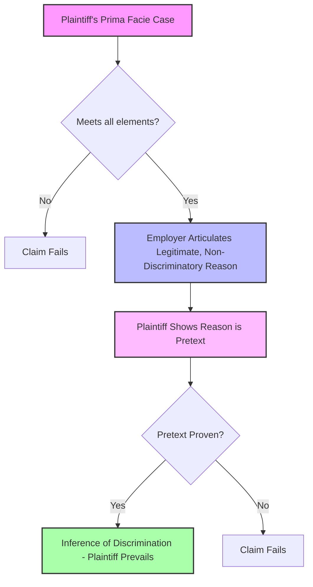
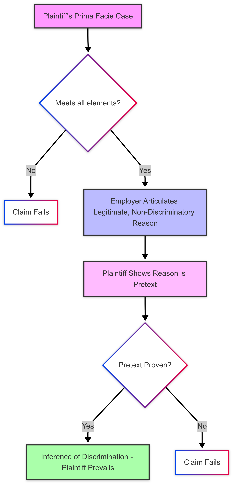

_This book introduces you to our legal system in the United States, the basic elements of a crime, the specific elements of commonly encountered crimes, and most criminal defenses. Criminal law always involves the government and government action, so you will also review the pertinent sections of the United States Constitution and its principles as they apply to criminal law. By the end of the book, you will be comfortable with the legal framework that governs the careers of criminal justice professionals._

## Behavior That Constitutes a Crime

Let’s begin at the beginning by defining a crime. The most basic definition of a crime is a behavior---either an act or failure to act--- that a law defines as deserving of punishment or penalty. You learn about criminal acts and failures (i.e., omissions) to act in [Chapter 4](../ch4/index.md). For now, it is important to understand that criminal act, omission to act, and criminal intent are elements or parts of every crime. Illegality is also an element of every crime. Generally, the government's publication of the a criminal law must specify the crime's elements before it can punish an individual for criminal behavior.

Criminal laws are the primary focus of this book. As you slowly start to build your knowledge and understanding of criminal law, you will notice some unique characteristics of the United States legal system. Laws differ significantly from state to state. Throughout the U.S., each state and the federal government criminalize different behaviors. Although this plethora of laws makes American legal studies more complicated for teachers and students, the size, cultural makeup, and geographic variety of our country demand this type of legal system.

## Law & Society
Laws in a democratic society, unlike laws of nature, are created by people and are founded in religious, cultural, and historical value systems. People from varying backgrounds live in different regions of this country. Thus you will see that different people enact distinct laws that best suit their needs. This book is intended for use in all states. However, the bulk of any criminal law overview is an examination of different crimes and their elements. To be accurate and representative, this book focuses on general principles that many states follow and provides frequent references to specific state laws for illustrative purposes. Always check the most current version of your state’s law because it may vary from the law presented in this book.

Laws are not static. As society changes, so do the laws that govern behavior. Evolving value systems naturally lead to new laws and regulations supporting modern beliefs. Although a certain stability is essential to the enforcement of rules, occasionally the rules must change.
Try to maintain an open mind when reviewing the different and often contradictory laws set forth in this book. Law is not exact, like science or math. Also try to become comfortable with the gray area, rather than viewing situations as black or white.

KEY: **Key Takeaways**
A crime is an an act or failure to act that a law defines as deserving of punishment or penalty. In general, the criminal law must be enacted before the crime is committed.

# Chapter X: Title VII Employment Discrimination

## I. Introduction to Title VII

Enacted as part of the **Civil Rights Act of 1964**, **Title VII** (codified at 42 U.S.C. § 2000e et seq.) prohibits employment discrimination based on:

- Race
- Color
- Religion
- Sex (including pregnancy, sexual orientation, and gender identity)
- National Origin

It applies to hiring, firing, compensation, promotion, and other terms and conditions of employment. Title VII is a central pillar of federal civil rights law, designed to eliminate discrimination in the workplace and foster equal opportunity.

---

## II. Scope and Coverage of Title VII

### A. Covered Employers

Title VII applies to:

- Private employers with **15 or more employees**
- State and local governments
- Federal government (by amendment)
- Employment agencies
- Labor organizations

Independent contractors are generally excluded unless they meet the common law agency test (*Nationwide Mut. Ins. Co. v. Darden*, 503 U.S. 318 (1992)).

### B. Protected Classes

- **Race**
- **Color**
- **Religion**
- **Sex** (includes gender identity and sexual orientation — *Bostock v. Clayton County*, 590 U.S. ___ (2020))
- **National Origin**

---

## III. Theories of Liability under Title VII

### A. Disparate Treatment

#### 1. Definition

Intentional discrimination where an employee is treated less favorably due to a protected characteristic.

#### 2. McDonnell Douglas Framework (411 U.S. 792 (1973))

- **Prima Facie Case**:
  1. Member of a protected class
  2. Qualified for the job
  3. Adverse employment action
  4. Circumstances support an inference of discrimination

- **Employer’s Burden**: Legitimate, non-discriminatory reason

- **Plaintiff’s Burden**: Show pretext for discrimination

#### 3. Mixed-Motive Analysis

- *Price Waterhouse v. Hopkins* (490 U.S. 228 (1989))
- 42 U.S.C. § 2000e–2(m): Discrimination need only be a **motivating factor**
- Remedies may be limited if employer would have made the same decision anyway

---

### B. Disparate Impact

#### 1. Definition

Facially neutral policy that disproportionately impacts a protected group without intent.

#### 2. Key Case: *Griggs v. Duke Power Co.*, 401 U.S. 424 (1971)

- **Plaintiff’s Burden**: Show statistical impact of a specific employment practice
- **Employer’s Burden**: Prove business necessity
- **Plaintiff May Rebut**: Show less discriminatory alternative exists

---

### C. Harassment / Hostile Work Environment

#### 1. Types

- **Quid Pro Quo**: Benefits conditioned on submission to sexual conduct
- **Hostile Work Environment**: Severe or pervasive conduct creating abusive conditions

#### 2. Employer Liability

- **Supervisors**: Vicarious liability (subject to *Faragher/Ellerth* defense)
- **Coworkers**: Negligence standard

**Cases**:
- *Faragher v. City of Boca Raton*, 524 U.S. 775 (1998)
- *Burlington Industries, Inc. v. Ellerth*, 524 U.S. 742 (1998)

---

### D. Retaliation

Prohibits adverse action against an employee for engaging in protected activity.

- **Key Case**: *Burlington Northern v. White*, 548 U.S. 53 (2006)
- Includes any materially adverse action that would deter a reasonable person

---

## IV. Procedural Requirements

1. **EEOC Charge**:
   - File within 180 days (or 300 days in a deferral state)
2. **Investigation** and possible conciliation
3. **Right to Sue Letter**: Must be issued by EEOC
4. **Federal Lawsuit**: Must be filed within 90 days of receiving the letter

Failure to exhaust administrative remedies typically bars a lawsuit.

---

## V. Remedies and Damages

### A. Legal and Equitable Relief

- **Back Pay**
- **Front Pay**
- **Reinstatement**
- **Compensatory Damages** (emotional distress)
- **Punitive Damages** (malice or reckless indifference)
- **Attorney’s Fees and Costs**

### B. Damage Caps (42 U.S.C. § 1981a(b)(3))

| Employer Size      | Cap on Compensatory + Punitive Damages |
|--------------------|----------------------------------------|
| 15–100 employees   | $50,000                                |
| 101–200 employees  | $100,000                               |
| 201–500 employees  | $200,000                               |
| 500+ employees     | $300,000                               |

*Note*: Caps do not apply to back pay, interest, or equitable relief.

---

## VI. Recent Developments

### A. **Bostock v. Clayton County** (2020)

- Held that Title VII’s prohibition on “sex” discrimination includes:
  - Sexual orientation
  - Gender identity

### B. **Groff v. DeJoy** (2023)

- Heightened the standard for denying religious accommodations
- Employer must prove **substantial hardship**, not minimal burden

---

## VII. Intersection with Other Laws

- **ADA**: Disability discrimination
- **ADEA**: Age (40+) discrimination
- **Equal Pay Act**: Sex-based wage disparities
- **§ 1981**: Racial discrimination in contracts (broader than Title VII)
- **State Laws**: May provide greater protection

---

## VIII. Conclusion

Title VII remains a vital instrument for addressing workplace discrimination. Through its evolving case law and statutory interpretation, it offers protection to millions of workers and continues to adapt to modern conceptions of equality and fairness.

---

## Suggested Readings and Resources

- Civil Rights Act of 1964, Title VII – Full text
- EEOC Compliance Manual
- Selected case briefs: *McDonnell Douglas*, *Griggs*, *Bostock*, *Faragher*, *Burlington Northern*

>? SUPP: **Supplementary Attributions**
>Except where otherwise noted, this page's content is adapted from:
>
> [1.1: Introduction](https://biz.libretexts.org/Bookshelves/CriminalLaw/IntroductiontoCriminalLaw/01%3AIntroductiontoCriminalLaw/1.01%3AIntroduction#) by [Lisa M. Storm](https://biz.libretexts.org/Bookshelves/CriminalLaw/IntroductiontoCriminalLaw/00%3AFrontMatter/05%3AAbouttheAuthors) is licensed [CC BY-NC-SA 3.0.](https://creativecommons.org/licenses/by-nc-sa/3.0)
>
> [crime.](https://www.law.cornell.edu/wex/crime) [Wex Legal Dictionary and Encyclopedia](https://www.law.cornell.edu/wex) by Cornell University's [Legal Information Institute](https://about.law.cornell.edu/) is licensed [CC BY-NC-SA 2.5.](https://creativecommons.org/licenses/by-nc-sa/2.5/)