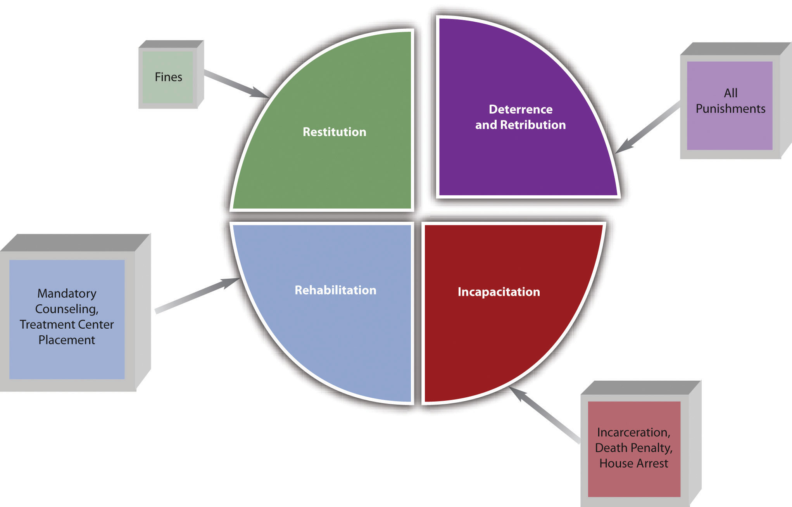

Generally, sanctions for criminal behavior (typically referred to as "punishment") has five recognized purposes: deterrence, incapacitation, rehabilitation, retribution, and restitution.

> VIDEO: **Watch and Learn**
> 
> - **Watch the beginning to 2:58 ("Reasons for Punishing Crime")**
>
> 
<iframe width="735" height="366" src="https://www.youtube.com/embed/Sgs6idCKTkE" title="Overview of Criminal Law: Module 1 of 5" frameborder="0" allow="accelerometer; autoplay; clipboard-write; encrypted-media; gyroscope; picture-in-picture; web-share" referrerpolicy="strict-origin-when-cross-origin" allowfullscreen></iframe>

>
>Source: *Overview of Criminal Law: Module 1 of 5* by [LawShelf.](https://www.youtube.com/@LawShelf) (Learn how to access the [transcript.](https://ecampusontario.pressbooks.pub/3rdpartytoolsaccessibility/chapter/youtube-transcript-instructions/))

## Specific and General Deterrence
Deterrence prevents future crime by frightening the defendant or the public. The two types of deterrence are **specific** and **general** deterrence. **Specific deterrence** applies to an _individual_ defendant. When the government punishes an individual defendant, they are theoretically less likely to commit another crime because of fear of another similar or worse punishment. **General deterrence** applies to the _public_ at large. When the public learns of an individual defendant’s punishment, the public is theoretically less likely to commit a crime because of fear of the punishment the defendant experienced. When the public learns, for example, that an individual defendant was severely punished by a sentence of life in prison or the death penalty, this knowledge can inspire a deep fear of criminal prosecution.

## Incapacitation
**Incapacitation** prevents future crime by removing the defendant from society. Examples of incapacitation are incarceration, house arrest, or execution pursuant to the death penalty.

## Rehabilitation
**Rehabilitation** prevents future crime by altering a defendant’s behavior. Examples of rehabilitation include educational and vocational programs, treatment center placement, and counseling. The court can combine rehabilitation with incarceration or with probation or parole. In some states, for instance, courts may require certain offenders to participate in rehabilitation in combination with probation, rather than submitting to incarceration. This lightens the load of jails and prisons while lowering recidivism, which means reoffending.

> EXAMPLE: **Example**
> In Wisconsin, a court may order offenders on probation to "complete an alcohol and other drug abuse treatment program."(1)
> { .annotate }
> 
> 1. [Wis. Stat. § 973.09(4)](https://docs.legis.wisconsin.gov/document/statutes/973.09(4)(c))

## Retribution
**Retribution** prevents future crime by removing the desire for personal avengement (in the form of assault, battery, and criminal homicide, for example) against the defendant. When victims or society discover that the defendant has been adequately punished for a crime, they achieve a certain satisfaction that our criminal procedure is working effectively, which enhances faith in law enforcement and our government.

## Restitution
**Restitution** prevents future crime by punishing the defendant _financially_. Restitution is when the court orders the criminal defendant to pay the victim for any harm and resembles a civil litigation damages award. Restitution can be for physical injuries, loss of property or money, and rarely, emotional distress. Restitution can also include a _fine_ that covers some of the costs of the criminal prosecution and punishment.

/// caption
<strong>Figure 1.2.1</strong> Different Punishments and Their Purposes
///

>KEY: **Key Takeaways**
>
>* Specific deterrence prevents crime by frightening an individual defendant with punishment.
>* General deterrence prevents crime by frightening the public with the punishment of an individual defendant.
>* Incapacitation prevents crime by removing a defendant from society.  
>* Rehabilitation prevents crime by altering a defendant’s behavior.  
>* Retribution prevents crime by giving victims or society a feeling of avengement.  
>* Restitution prevents crime by punishing the defendant financially.  

## Exercises
### Exercise 1.2.1

<strong>Q:</strong> What is one difference between criminal victims’ restitution and civil damages?

  

    <strong>A:</strong> The court awards criminal restitution to the victim after a state or federal prosecutor is successful in a criminal trial. Thus the victim receives the restitution award without paying for a private attorney. A plaintiff that receives damages has to pay a private attorney to win the civil litigation matter.
  

  <button class="reveal-button" onclick="toggleAnswer(this)">Answer</button>

### Exercise 1.2.2

<strong>Q:</strong> Read <em>Campbell v. State</em>, <a href="https://scholar.google.com/scholar_case?case=11316909200521760089&hl=en&as_sdt=2&as_vis=1&oi=scholarr">5 S.W.3d 693 (Tex. Crim. App. 1999).</a> Why did the defendant in this case claim that the restitution award was too high? Did the Texas Court of Criminal Appeals agree with the defendant’s claim?

  

    <strong>A:</strong> In <em>Campbell</em>, the defendant entered a plea agreement specifying that he had committed theft in an amount under $100,000. The trial court determined that the defendant had actually stolen $100,000 and awarded restitution of $100,000 to various victims. The defendant claimed that this amount was excessive because it exceeded the parameters of the theft statute he was convicted of violating. The Texas Court of Criminal Appeals disagreed and held that the discretion of how much restitution to award belongs to the judge. As long as the judge properly ascertained this amount based on the facts, restitution could exceed the amount specified in the criminal statute the defendant was convicted of violating.
  

  <button class="reveal-button" onclick="toggleAnswer(this)">Answer</button>

 

>? SUPP: **Supplementary Attributions**
>Except where otherwise noted, this page's content is adapted from: [1.4: The Purposes of Punishment](https://2012books.lardbucket.org/books/introduction-to-criminal-law/s05-05-the-purposes-of-punishment.html) by [Lisa M. Storm](https://2012books.lardbucket.org/books/introduction-to-criminal-law/s01-about-the-author.html) is licensed [CC BY-NC-SA 3.0.](https://creativecommons.org/licenses/by-nc-sa/3.0)