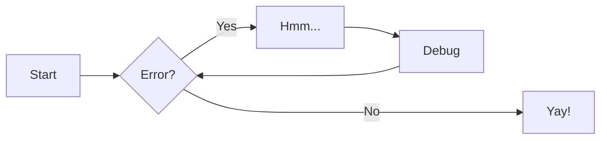
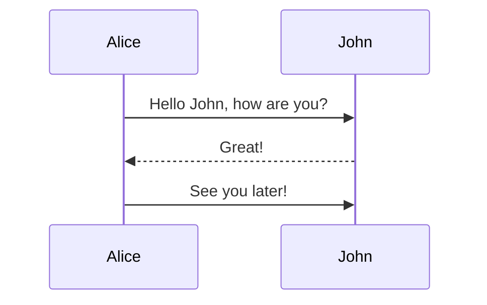
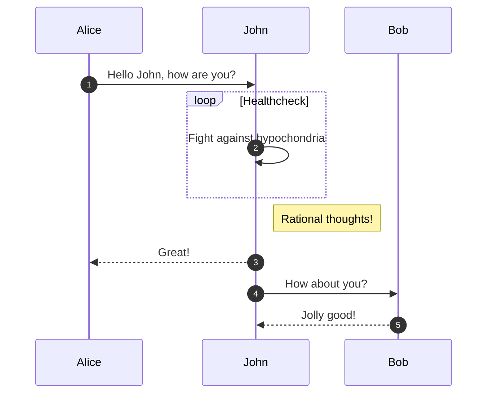
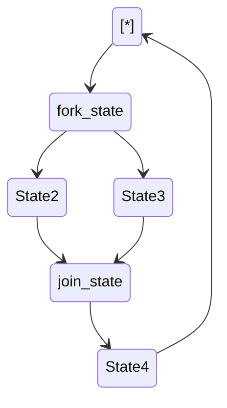
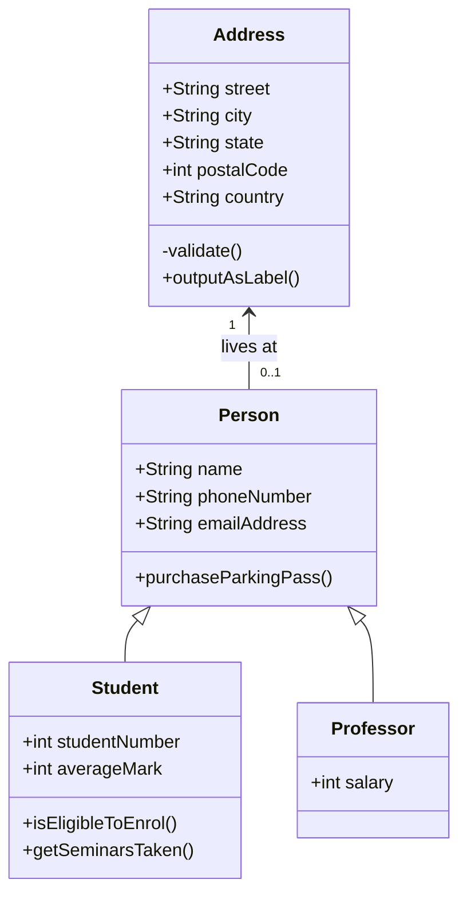

# Tools
## Icons/Emojis
[Icon/Emoji search](https://squidfunk.github.io/mkdocs-material/reference/icons-emojis/#search)
## Icons with Color
[with color](https://squidfunk.github.io/mkdocs-material/reference/icons-emojis/#with-colors")
## Icons with Animations
[with animations](https://squidfunk.github.io/mkdocs-material/reference/icons-emojis/#with-animations)
## Admonitions
### Admonition with Icon
NOTE: Lorem ipsum dolor sit amet, consectetur adipiscing elit. Nulla et euismod nulla. Curabitur feugiat, tortor non consequat finibus, justo purus auctor massa, nec semper lorem quam in massa.
### Admonition with Customized Title
NOTE: \*\*Customized Title\*\*
Lorem ipsum dolor sit amet, consectetur adipiscing elit. Nulla et euismod nulla. Curabitur feugiat, tortor non consequat finibus, justo purus auctor massa, nec semper lorem quam in massa.
### Nested Admonition
!!! note "Outer Note"
Lorem ipsum dolor sit amet, consectetur adipiscing elit. Nulla et euismod
nulla. Curabitur feugiat, tortor non consequat finibus, justo purus auctor
massa, nec semper lorem quam in massa.
!!! note "Inner Note"
Lorem ipsum dolor sit amet, consectetur adipiscing elit. Nulla et euismod
nulla. Curabitur feugiat, tortor non consequat finibus, justo purus auctor
massa, nec semper lorem quam in massa.
### Removing Admonition Title (only outline of box)
!!! note ""
Lorem ipsum dolor sit amet, consectetur adipiscing elit. Nulla et euismod
nulla. Curabitur feugiat, tortor non consequat finibus, justo purus auctor
massa, nec semper lorem quam in massa.
### Collapsible Block Admonitions
#### Collapsible: Initially Collapsed
>? NOTE:
>Lorem ipsum dolor sit amet, consectetur adipiscing elit. Nulla et euismod nulla. Curabitur feugiat, tortor non consequat finibus, justo purus auctor massa, nec semper lorem quam in massa.
??? note
Lorem ipsum dolor sit amet, consectetur adipiscing elit. Nulla et euismod
nulla. Curabitur feugiat, tortor non consequat finibus, justo purus auctor
massa, nec semper lorem quam in massa.
#### Collapsible: Initially Expanded
>! NOTE:
>Lorem ipsum dolor sit amet, consectetur adipiscing elit. Nulla et euismod nulla. Curabitur feugiat, tortor non consequat finibus, justo purus auctor massa, nec semper lorem quam in massa.
???+ note
Lorem ipsum dolor sit amet, consectetur adipiscing elit. Nulla et euismod
nulla. Curabitur feugiat, tortor non consequat finibus, justo purus auctor
massa, nec semper lorem quam in massa.
#### Supplementary Attributions
>? SUPP: \*\*Supplementary Attributions\*\*
>Except where otherwise noted, this page's content is adapted from:
>
>\* [1.3: Modern Legal Systems of the World](https://biz.libretexts.org/@go/page/41994) by [Melissa Randall and Community College of Denver Students](https://www.ccd.edu/directory/melissa-randall/) is licensed [CC BY 4.0.](https://creativecommons.org/licenses/by/4.0/) [(Original source.)](https://introductiontobusinesslaw.pressbooks.com)
>
>\* [legal systems.](https://www.law.cornell.edu/wex/legal\_systems) [\_Wex Legal Dictionary and Encyclopedia\_](https://www.law.cornell.edu/wex) by Cornell University's [Legal Information Institute](https://about.law.cornell.edu/) is licensed [CC BY-NC-SA 2.5.](https://creativecommons.org/licenses/by-nc-sa/2.5/)
>
>\* [Legal Training Handbook](https://www.fletc.gov/sites/default/files/st-1000-fy23-with-cover.pdf) (2023), §§ 18.1-18.2, 18.6-18.6.2, by [U.S. Dept. of Homeland Security Federal Law Enforcement Training Centers](https://www.fletc.gov/) Office of Chief Counsel, Amanda Barak & Lindsey Brower, Editors. This content page is in the [public domain.](https://www.law.cornell.edu/uscode/text/17/105)
>
>\* [4.1: Investigative Detentions](https://workforce.libretexts.org/Bookshelves/Corrections/Principles\_and\_Procedures\_of\_the\_Justice\_System\_\(Alvarez\)/04%3A\_Detentions\_Based\_on\_Reasonable\_Suspicion/4.1%3A\_Investigative\_Detentions) by [Larry Alvarez](https://www.canyons.edu/directory/larry-alvarez.php), used under [CC BY 4.0.](https://creativecommons.org/licenses/by/4.0/)
## Annotations
### Basic
Lorem ipsum dolor sit amet, (1) consectetur adipiscing elit.
{ .annotate }
1. I'm an annotation! I can contain `code`, \_\_formatted
text\_\_, images, ... basically anything that can be expressed in Markdown.
### Nested Annotations
Lorem ipsum dolor sit amet, (1) consectetur adipiscing elit.
{ .annotate }
1. I'm an annotation! (1)
{ .annotate }
1. I'm an annotation as well!
### Annotation Tooltip Width
See extra\_css with this text:
:root {
--md-tooltip-width: 600px;
}
### Within Admonitions
!!! tip annotate "Phasellus posuere in sem ut cursus (1)"
Lorem ipsum dolor sit amet, (2) consectetur adipiscing elit. Nulla et
euismod nulla. Curabitur feugiat, tortor non consequat finibus, justo
purus auctor massa, nec semper lorem quam in massa.
1. :man\_raising\_hand: I'm an annotation!
2. :woman\_raising\_hand: I'm an annotation as well!
### Within Content Tabs
=== "Tab 1"
Lorem ipsum dolor sit amet, (1) consectetur adipiscing elit.
{ .annotate }
1. :man\_raising\_hand: I'm an annotation!
=== "Tab 2"
Phasellus posuere in sem ut cursus (1)
{ .annotate }
1. :woman\_raising\_hand: I'm an annotation as well!
### HTML with Annotations (just an example)

> Lorem ipsum dolor sit amet, (1) consectetur adipiscing elit.

1. :man\_raising\_hand: I'm an annotation!
## Footnotes
### Text with Footnotes
Lorem ipsum[^1] dolor sit amet, consectetur adipiscing elit.[^2]
## Content Tabs
### Basic
=== "Unordered list"
\* Sed sagittis eleifend rutrum
\* Donec vitae suscipit est
\* Nulla tempor lobortis orci
=== "Ordered list"
1. Sed sagittis eleifend rutrum
2. Donec vitae suscipit est
3. Nulla tempor lobortis orci
### Embedded Content: Content Tabs in Admonition
!!! example
=== "Unordered List"
``` markdown
\* Sed sagittis eleifend rutrum
\* Donec vitae suscipit est
\* Nulla tempor lobortis orci
```
=== "Ordered List"
``` markdown
1. Sed sagittis eleifend rutrum
2. Donec vitae suscipit est
3. Nulla tempor lobortis orci
```
## Basic Tooltips/Abbreviations
Text with tooltips/abbreviations
The HTML specification is maintained by the W3C.
\*[HTML]: Hyper Text Markup Language
\*[W3C]: World Wide Web Consortium
### Other Usage
#### Link with tooltip, inline syntax
[Hover me](https://www.google.com "I'm a tooltip!")
#### Link with tooltip, reference syntax
[Hover me][https://www.google.com]
[https://www.google.com]: https://www.google.com "I'm a tooltip!"
### Icon with tooltip
:material-information-outline:{ title="Important information" }
## Lists
### Ordered Lists
1. Vivamus id mi enim. Integer id turpis sapien. Ut condimentum lobortis
sagittis. Aliquam purus tellus, faucibus eget urna at, iaculis venenatis
nulla. Vivamus a pharetra leo.
1. Vivamus venenatis porttitor tortor sit amet rutrum. Pellentesque aliquet
quam enim, eu volutpat urna rutrum a. Nam vehicula nunc mauris, a
ultricies libero efficitur sed.
2. Morbi eget dapibus felis. Vivamus venenatis porttitor tortor sit amet
rutrum. Pellentesque aliquet quam enim, eu volutpat urna rutrum a.
1. Mauris dictum mi lacus
2. Ut sit amet placerat ante
3. Suspendisse ac eros arcu
### Unordered Lists
- Nulla et rhoncus turpis. Mauris ultricies elementum leo. Duis efficitur
accumsan nibh eu mattis. Vivamus tempus velit eros, porttitor placerat nibh
lacinia sed. Aenean in finibus diam.
\* Duis mollis est eget nibh volutpat, fermentum aliquet dui mollis.
\* Nam vulputate tincidunt fringilla.
\* Nullam dignissim ultrices urna non auctor.
## Buttons
[Adding buttons](https://squidfunk.github.io/mkdocs-material/reference/buttons/#adding-buttons)
## Grids
[See the guide](https://squidfunk.github.io/mkdocs-material/reference/grids/#usage")
## Tables
See [Using data tables](https://squidfunk.github.io/mkdocs-material/reference/data-tables/#usage)
See also [Column alignment](https://squidfunk.github.io/mkdocs-material/reference/data-tables/#column-alignment)
## Glossary
\*[HTML]: Hyper Text Markup Language
\*[W3C]: World Wide Web Consortium
### Terms in Text
Do you like chicken? That depends on the totality of the circumstances.
Note about glossary \_when a glossary is in a separate file\_: When using a dedicated file outside of the docs folder, add the parent directory to the list of watch folders so that when the glossary file is updated, the project is automatically reloaded when running mkdocs serve.
## Definition Lists
[Using definition list](https://squidfunk.github.io/mkdocs-material/reference/lists/#using-definition-lists)
## Footnote Section
[^1]: (Short footnote inline) Lorem ipsum dolor sit amet, consectetur adipiscing elit.
[^2]:
(Paragraph footntote--see this is a new line) Lorem ipsum dolor sit amet, consectetur adipiscing elit. Nulla et euismod
nulla. Curabitur feugiat, tortor non consequat finibus, justo purus auctor
massa, nec semper lorem quam in massa.
## Images
{align=left width=90}
Lorem ipsum dolor sit amet, consectetur adipiscing elit. Nulla et euismod nulla. Curabitur feugiat, tortor non consequat finibus, justo purus auctor massa, nec semper lorem quam in massa.
### Image Alignment
[alignment](https://squidfunk.github.io/mkdocs-material/reference/images/#image-alignment)
### Image Lazy Loading
[lazy loading](https://squidfunk.github.io/mkdocs-material/reference/images/#image-lazy-loading)
### Image with Caption
{width=90}
/// caption
caption
///
## Colors
### Custom Colors
in mkdocs yml, change the theme's palette for "primary" an/dor "accent" to custom. If you do this, add this to the extra.css (changing the preferred colors)
:root > \* {
--md-primary-fg-color: #EE0F0F;
--md-primary-fg-color--light: #ECB7B7;
--md-primary-fg-color--dark: #90030C;
}
Also, see [color definitions](https://github.com/squidfunk/mkdocs-material/blob/master/src/templates/assets/stylesheets/main/\_colors.scss).
### Custom Color Scheme
in mkdocs yml, change the theme's palette for "scheme" to "customschemename." If you do this, add this to the extra.css (changing the preferred colors)
[data-md-color-scheme="customschemename"] {
--md-primary-fg-color: #EE0F0F;
--md-primary-fg-color--light: #ECB7B7;
--md-primary-fg-color--dark: #90030C;
}
### Color Scheme for Slate
[data-md-color-scheme="slate"] {
--md-hue: 210;
}
## Buttons
### Button (Outlined/Basic)
[Subscribe to our newsletter](https://www.google.com){ .md-button }
### Button (Filled/"Primary")
[Subscribe to our newsletter](#){ .md-button .md-button--primary }
### Button with Icon
[Send :fontawesome-solid-paper-plane:](https://www.google.com){ .md-button }
## Cards/Grids
### Example 1

- :fontawesome-brands-html5: \_\_HTML\_\_ for content and structure
- :fontawesome-brands-js: \_\_JavaScript\_\_ for interactivity
- :fontawesome-brands-css3: \_\_CSS\_\_ for text running out of boxes
- :fontawesome-brands-internet-explorer: \_\_Internet Explorer\_\_ ... huh?

### Example 2

- :material-clock-fast:{ .lg .middle } \_\_Set up in 5 minutes\_\_
---
Install [`mkdocs-material`](https://www.google.com) with [`pip`](https://www.google.com) and get up
and running in minutes
[:octicons-arrow-right-24: Getting started](https://www.google.com)
- :fontawesome-brands-markdown:{ .lg .middle } \_\_It's just Markdown\_\_
---
Focus on your content and generate a responsive and searchable static site
[:octicons-arrow-right-24: Reference](https://www.google.com)
- :material-format-font:{ .lg .middle } \_\_Made to measure\_\_
---
Change the colors, fonts, language, icons, logo and more with a few lines
[:octicons-arrow-right-24: Customization](https://www.google.com)
- :material-scale-balance:{ .lg .middle } \_\_Open Source, MIT\_\_
---
Material for MkDocs is licensed under MIT and available on [GitHub]
[:octicons-arrow-right-24: License](https://www.google.com)

## Flowcharts & Diagrams
### Flowcharts

### Sequence Diagrams
#### Simple Example

#### Complex Example

### State Diagrams

### Class Diagrams

### Other Diagrams
[Other Diagrams](https://squidfunk.github.io/mkdocs-material/reference/diagrams/#other-diagram-types)
## Hide/Ellide/Reveal Text

This is a sentence that is initially hidden but will be revealed
... clicking the arrow can hide it again.

## Video in Frame
\*\*\*
!!! video "Watch & Learn"

[!NOTE]
Markdown can't embed this iframe. Here's the source:
[Reasonable Expectation of Privacy](https://www.youtube.com/embed/5rT7G\_11lSs)

Source: \*Reasonable Expectation of Privacy\* by [LawShelf.](https://www.youtube.com/@LawShelf) (Learn how to access the [transcript.](https://ecampusontario.pressbooks.pub/3rdpartytoolsaccessibility/chapter/youtube-transcript-instructions/))
\*\*\*
Note: For LawShelf video transcript: (See the [transcript.](https://www.lawshelf.com/videos/entry/sources-of-law-in-the-united-states))
[\*\*OR Try This Plugin\*\*](https://pypi.org/project/mkdocs-video/#configuration)
## Quizzes
Some \*\*markdown\*\* content.
:::{quizdown}
---
primaryColor: steelblue
shuffleQuestions: false
shuffleAnswers: true
---
# What is the capital of France?
> Paris is the capital and largest city of France.
1. [x] Paris
2. [ ] London
3. [ ] Berlin
4. [ ] Madrid
:::
Some \*\*markdown\*\* content.
\*\*\*