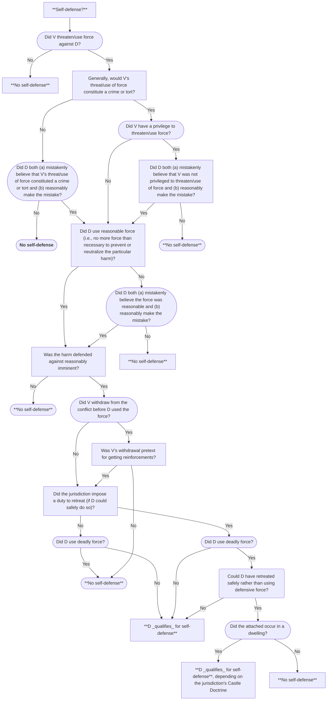

```mermaid
graph TD
    A["**Self-defense?**"] --> B(["Did V threaten/use force against D?"])
    B -->|No| C["**No self-defense**"]
    B -->|Yes| D["Generally, would V's threat/use of force constitute a crime or tort?"]
    D -->|No| E(["Did D both (a) mistakenly believe that V's threat/use of force constituted a crime or tort and (b) reasonably make the mistake?"])
    E -->|No| K(["`**No self-defense**`"])
    E -->|Yes| L["Did D use reasonable force (i.e., no more force than necessary to prevent or neutralize the particular harm)?"]
        D -->|Yes| F(["Did V have a privilege to threaten/use force?"])
    F -->|No| L
    F -->|Yes| G["Did D both (a) mistakenly believe that V was not privileged to threaten/use of force and (b) reasonably make the mistake?"]
    G -->|Yes| L    
    G -->|No| J(["**No self-defense**"])
    L -->|Yes| M[Was the harm defended against reasonably imminent?]
    M -->|No| P(["**No self-defense**"])
    L -->|No| N(["Did D both (a) mistakenly believe the force was reasonable and (b) reasonably make the mistake?"])
    N -->|Yes| M
    N -->|No| O["**No self-defense**"]
    M -->|Yes| Q([Did V withdraw from the conflict before D used the force?])
    Q -->|No| S["Did the jurisdiction impose a duty to retreat (if D could safely do so)?"]
    S -->|No| T([Did D use deadly force?])
    T -->|No| AA[**D _qualifies_ for self-defense**]
    T -->|Yes| U(["xxx"])
    S -->|Yes| V([Did D use deadly force?])
    V -->|Yes| W(Could D have retreated safely rather than using defensive force?)
    V -->|No| AA
    W -->|No| AA
    W -->|Yes| X([Did the attached occur in a dwelling?])
    X -->|Yes| BB[**D _qualifies_ for self-defense**, depending on the jurisdiction's Castle Doctrine]
    X -->|No| Z["**No self-defense**"]
    Q -->|Yes| R[Was V's withdrawal pretext for getting reinforcements?]
    R -->|Yes| S
    R -->|No| U(["**No self-defense**"])

```
